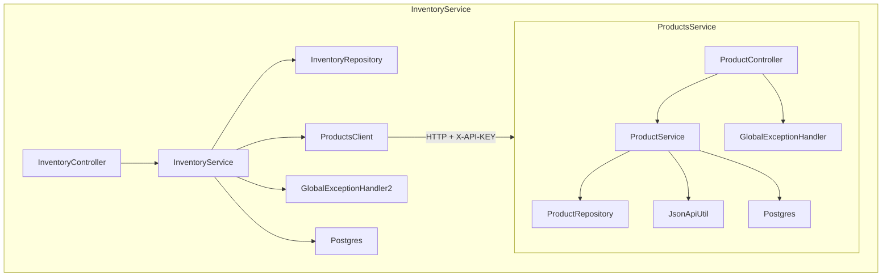

# Backend — Prueba Técnica Full Stack (Products + Inventory)

## Resumen rápido
Repositorio backend compuesto por dos microservicios Java + Spring Boot:

backend/products-service/ → Gestor de productos (CRUD).

backend/inventory-service/ → Gestor de inventario que consulta products-service.

Cada microservicio tiene su propia base de datos PostgreSQL (aislamiento), Docker, healthchecks, documentación OpenAPI y tests con JaCoCo. Se implementaron mecanismos de resiliencia, autenticación interna entre servicios (X-API-KEY) y logs estructurados listos para producción.

---

## 🚀 Tecnologías
- Java 17, Spring Boot 3
- Spring Data JPA + PostgreSQL
- Springdoc OpenAPI (Swagger)
- Spring Boot Actuator (healthchecks)
- Resilience4j (reintentos, timeouts, fallback)
- Docker + Docker Compose
- JUnit 5, MockMvc, JaCoCo (tests + cobertura)
- Logback JSON (logs estructurados)

---

## Índice
- [Cómo ejecutar (rápido)](#cómo-ejecutar-rápido)
- [Estructura del proyecto](#estructura-del-proyecto)
- [Diagramas](#diagramas)
- [Endpoints y ejemplos cURL](#endpoints-y-ejemplos-curl)
- [Seguridad entre servicios](#seguridad-entre-servicios)
- [Resiliencia y healthchecks](#resiliencia-y-healthchecks)
- [Logs estructurados](#logs-estructurados)
- [Tests y cobertura](#tests-y-cobertura)
- [Guía técnica para desarrolladores](#guía-técnica-para-desarrolladores)
- [Checklist de requisitos](#checklist-de-requisitos)
- [Troubleshooting rápido](#troubleshooting-rápido)

---

## 1. Cómo ejecutar (rápido)

### Opcion 1: Ejecutar Localmente los microservicios
Desde la terminal o IDE, recuerda configurar y crear las bases de datos en postgresql y application.yml con valores reales:
🧩 Products
```bash
cd backend/products-service
mvn spring-boot:run
```

🧩 Inventory
```bash
cd backend/inventory-service
mvn spring-boot:run
```

### 🔍 Verificación de Servicios

Cuando ambos microservicios estén corriendo correctamente, puedes verificar su estado y documentación en los siguientes endpoints:

| **Servicio** | **Puerto** | **Healthcheck** | **Swagger UI** |
|---------------|------------|-----------------|----------------|
| 🧩 Products   | `8080`     | [http://localhost:8080/actuator/health](http://localhost:8080/actuator/health) | [http://localhost:8080/swagger-ui.html](http://localhost:8080/swagger-ui.html) |
| 📦 Inventory  | `8081`     | [http://localhost:8081/actuator/health](http://localhost:8081/actuator/health) | [http://localhost:8081/swagger-ui.html](http://localhost:8081/swagger-ui.html) |

---

### Opcion 2: Compila los JARs y levanta todo con Docker Compose (incluyendo override para healthchecks):
 construir jars (desde la raíz del repo) - para ejecucion con Docker
 ```bash
cd backend/products-service
mvn clean package -DskipTests
cd ../inventory-service
mvn clean package -DskipTests
cd ../../

# 1. Empaqueta ambos proyectos en archivos JAR
mvn clean package -DskipTests
```

### 🐳 Comandos Docker útiles para los microservicios

| **Acción** | **Comando** | **Descripción** |
|-------------|--------------|-----------------|
| 🔹 **Levantar todo el entorno (con logs en consola)** | `docker-compose up` | Inicia los microservicios (`products`, `inventory`) y sus bases de datos (`products-db`, `inventory-db`). Muestra los logs en tiempo real. |
| 🔹 **Levantar todo en segundo plano (modo daemon)** | `docker-compose up -d` | Inicia los contenedores sin mostrar los logs en consola. Ideal para dejar el entorno corriendo en segundo plano. |
| 🔹 **Reconstruir las imágenes y levantar los servicios** | `docker-compose up --build` | Reconstruye los contenedores (útil si cambiaste código o dependencias) y los inicia. |
| 🔹 **Reiniciar todo el entorno limpio (incluyendo volúmenes)** | `docker-compose down -v && docker-compose up --build` | Elimina contenedores, redes y volúmenes; luego reconstruye todo desde cero. |
| 🔹 **Ver todos los contenedores activos** | `docker ps` | Muestra los contenedores en ejecución y sus puertos mapeados. |
| 🔹 **Ver logs de un servicio específico** | `docker-compose logs -f products` | Muestra los logs del microservicio `products` en tiempo real. Puedes cambiar `products` por `inventory` - Requisito de la pureba puedes ver el log del evento por la consola con este comando. |
| 🔹 **Detener todos los servicios** | `docker-compose down` | Detiene y elimina los contenedores, pero conserva las imágenes y volúmenes. |
| 🔹 **Detener contenedores sin eliminarlos** | `docker-compose stop` | Detiene temporalmente los contenedores sin borrarlos. Puedes reanudarlos con `docker-compose start`. |
| 🔹 **Ver logs combinados de todos los servicios** | `docker-compose logs -f` | Muestra en tiempo real los logs de todos los microservicios y bases de datos. |
| 🔹 **Eliminar imágenes huérfanas y caché innecesaria** | `docker system prune -f` | Limpia espacio eliminando imágenes y contenedores no usados. |
| 🔹 **Entrar a la consola de un contenedor** | `docker exec -it products bash` | Abre una terminal dentro del contenedor `products` (útil para depurar internamente). |
| 🔹 **Ver bases de datos PostgreSQL en ejecución** | `docker exec -it products-db psql -U postgres -d fullstack_product` | Accede directamente a la base de datos del microservicio `products`. Cambia a `inventory-db` si lo necesitas. |
| 🔹 **Ver uso de recursos (CPU/RAM) de los contenedores** | `docker stats` | Monitorea el consumo de CPU y memoria de todos los contenedores en ejecución. |
| 🔹 **Eliminar solo los contenedores detenidos** | `docker container prune -f` | Borra todos los contenedores que no están en ejecución, liberando espacio. |


### 📋 Estado actual de los contenedores (comando docker ps)

| **Nombre del contenedor** | **Imagen** | **Puerto local → interno** | **Estado** | **Descripción** |
|-----------------------------|-------------|-----------------------------|-------------|------------------|
| 🧩 `products-service` | `backend-products` | `8081 → 8080` | ✅ Up | Microservicio de **Productos** — escucha en [http://localhost:8081](http://localhost:8081) |
| 📦 `inventory-service` | `backend-inventory` | `8082 → 8080` | ✅ Up | Microservicio de **Inventario** — escucha en [http://localhost:8082](http://localhost:8082) |
| 🐘 `products-db` | `postgres:15` | `5433 → 5432` | ✅ Up (healthy) | Base de datos **PostgreSQL** del microservicio *Products* |
| 🐘 `inventory-db` | `postgres:15` | `5434 → 5432` | ✅ Up (healthy) | Base de datos **PostgreSQL** del microservicio *Inventory* |
| 🧭 `backend-adminer-1` | `adminer` | `8080 → 8080` | ✅ Up | Herramienta **gráfica** para explorar ambas bases de datos PostgreSQL |


## 🚀 Cómo probar Adminer

🐘 **Adminer (gestor visual de DB)** — herramienta **gráfica** para explorar ambas bases de datos **PostgreSQL**.

| **Parámetro** | **Valor** |
|----------------|------------|
| 🌐 **URL** | [http://localhost:8080](http://localhost:8080) |
| 🖥️ **Servidor** | `products-db`  o  `inventory-db` |
| 👤 **Usuario** | `postgres` |
| 🔑 **Contraseña** | `TU CONTRASEÑA DE PSOGRESQL` |
| 🗃️ **Base de datos** | `fullstack_product`  o  `fullstack_inventory` 

---

## 2. Estructura del proyecto (archivos clave)
```pgsql
backend/
 ├─ products-service/
 │   ├─ pom.xml
 │   ├─ Dockerfile
 │   ├─ .env
 │   └─ src/main/java/com/example/products/
 │       ├─ ProductsServiceApplication.java
 │       ├─ controller/ProductController.java
 │       ├─ service/ProductService.java
 │       ├─ repository/ProductRepository.java
 │       ├─ entity/Product.java
 │       ├─ dto/ProductDto.java
 │       ├─ exception/GlobalExceptionHandler.java
 │       ├─ util/JsonApiUtil.java
 │       └─ resources/
 │           ├─ application.yml
 │           └─ logback-spring.xml  (logs JSON)
 ├─ inventory-service/
 │   ├─ pom.xml
 │   ├─ Dockerfile
 │   ├─ .env
 │   └─ src/main/java/com/example/inventory/
 │       ├─ InventoryServiceApplication.java
 │       ├─ controller/InventoryController.java
 │       ├─ service/InventoryService.java
 │       ├─ repository/InventoryRepository.java
 │       ├─ entity/Inventory.java
 │       ├─ client/ProductsClient.java
 │       ├─ security/ApiKeyFilter.java
 │       └─ exception/GlobalExceptionHandler.java
 ├─ docker-compose.yml
 └─ docker-compose.override.yml
```

---

## 3. Diagramas
Arquitectura (mermaid)
```mermaid
flowchart LR
  Browser["Frontend (Next.js)"]
  subgraph Backend
    P[Products Service<br/>port 8081]
    I[Inventory Service<br/>port 8082]
    PDB[(Products PostgreSQL)]
    IDB[(Inventory PostgreSQL)]
  end

  Browser -->|GET /api/products| P
  Browser -->|GET /api/inventories/{id}| I
  I -->|HTTP + X-API-KEY| P
  P --> PDB
  I --> IDB
  Adminer["Adminer (DB UI)"] --> PDB
  Adminer --> IDB
```

Componentes internos (mermaid)


---

## 4. Endpoints y ejemplos cURL
Products
- POST /api/products → Crear producto
```bash
curl -X POST http://localhost:8081/api/products \
  -H "Content-Type: application/json" \
  -d '{"name":"Laptop","description":"Dell XPS","price":1299.99,"sku":"XPS13"}'
```

- GET /api/products → Lista paginada de productos.
```bash
curl -X GET http://localhost:8081/api/products
```

- GET /api/products/{id} → Obtiene un producto por ID (Clave para el cliente de Inventario).
```bash
curl -X POST http://localhost:8081/api/products/{id}
```
- PATCH /api/products/{id} → Actualizar producto
```bash
curl -X PATCH http://localhost:8081/api/products/{id}
```
DELETE /api/products/{id} → Eliminar producto
```bash
curl -X DELETE http://localhost:8081/api/products/{id}
```

Inventory
- POST /api/inventories/{productId}?quantity=100 → Actualiza el stock(ej. {"changeQuantity": 10}).
```bash
curl -X POST http://localhost:8082/api/products/{id}
```

- GET /api/inventory/{id} → Consulta stock y detalles del producto
```bash
curl -X GET "http://localhost:8082/api/inventories/{id}"
```
Nota: Inventory -> Products cuando necesita consultar product usa X-API-KEY header. Si llamas directamente al products desde fuera (por pruebas), no es necesario el header (a menos que en tu implementación decidas exigirlo también para llamadas externas).

---

## 5. Seguridad entre servicios (X-API-KEY)
- Dónde: inventory-service/client/ProductsClient.java añade el header X-API-KEY con PRODUCTS_API_KEY (lee de .env).
- Validación opcional: puedes validar el header en products-service con un filtro (ApiKeyFilter o @RequestHeader checks) — ejemplo de archivo: products-service/src/main/java/.../security/ApiKeyFilter.java.
- .env (ejemplo):
    - products-service/.env → INTERNAL_API_KEY=products-internal-key-123

    - inventory-service/.env → PRODUCTS_API_KEY=products-internal-key-123

---

## 6. Resiliencia y healthchecks
- Resilience4j configurado en inventory-service/pom.xml y en inventory-service/src/main/resources/application.yml (retry + timeLimiter).
    - ProductsClient usa @Retry(name="productsClient") y fallback.
- Actuator: ambos servicios exponen /actuator/health (configurado en application.yml).
- docker-compose.override.yml incluye healthcheck para:
    - Postgres readiness (pg_isready)
    - Service readiness (curl -f http://localhost:8080/actuator/health || exit 1)
- Con esto inventory espera a que products esté realmente listo antes de arrancar (dependencias saludables).

---

## 7. Logs estructurados (Logback JSON)
Se incluye un logback-spring.xml sugerido en src/main/resources/:
```xml
<configuration>
  <include resource="org/springframework/boot/logging/logback/defaults.xml"/>
  <appender name="JSON" class="ch.qos.logback.core.ConsoleAppender">
    <encoder class="net.logstash.logback.encoder.LogstashEncoder" />
  </appender>
  <root level="INFO">
    <appender-ref ref="JSON"/>
  </root>
</configuration>
```
- Beneficio: los logs salen en JSON (campos timestamp, level, logger, message, stacktrace) listos para ELK/Graylog/Grafana Loki.
- Dónde: products-service/src/main/resources/logback-spring.xml y inventory-service/.../logback-spring.xml.

## ✅ Checklist Requisitos
- JSON:API responses (cumplido con JsonApiUtil y controladores).
- Autenticación entre servicios con X-API-KEY.
- Healthchecks expuestos con Actuator.
- Resiliencia con Resilience4j (retries, timeouts, fallback).
- Documentación OpenAPI (/swagger-ui.html).
- Docker Compose + override con healthchecks.
- Logs estructurados listos para producción.
- Tests unitarios e integración con JaCoCo.

---

## 8. Tests y cobertura (JaCoCo)
- Configuración: plugin JaCoCo en pom.xml de cada servicio.
    - Ejecutar: mvn test y luego mvn jacoco:report.
    - Reporte: target/site/jacoco/index.html.

- Estado:
    - Se incluyen tests base (ProductControllerTest, tests de InventoryService pending).
    - Objetivo mínimo (Mid): ≥60% de cobertura global en backend.- - - Objetivo Senior: ≥80% — para lograrlo añadir:
        - Tests unitarios para servicios (happy + edge cases).
        - Tests de integración con MockWebServer/WireMock para simular products-service en pruebas de inventory-service.
        - Tests para errores (not found, validation, errores de upstream).

### Estrategia para subir cobertura a ≥80%:
1. Añadir tests para InventoryService.decrease (insuficiente stock, decremento correcto).
2. Tests para mappers/JsonApiUtil.
3. Tests de fallbacks de Resilience4j (simular timeouts).
4. Test de GlobalExceptionHandler (mapear respuestas de error JSON:API).

---

## 9. Guía técnica para desarrolladores (onboarding y extensiones)
- Onboarding rápido
    1. Instala: JDK 17, Maven, Docker, Docker Compose.
    2. Clona repo y compila ambos servicios (mvn package -DskipTests).
    3. Modifica .env si necesitas credenciales distintas.
    4. Levanta con Docker Compose.

### Puntos de extensión más comunes
- Autenticación entre servicios: actualmente X-API-KEY. Para producción: migrar a mTLS o token firmado (JWT con claims service-to-service).
- Auditoría: añadir entidad AuditLog y publicar eventos en Kafka/RabbitMQ cuando stock cambia o producto creado.
- Observability: añadir Prometheus + Grafana, exponer métricas custom (/actuator/prometheus).
- Tracing: agregar Spring Cloud Sleuth / OpenTelemetry para trazas distribuidas entre services.
- Rate-limiting: añadir bucket4j si necesitas proteger servicios de abusos.

### Buenas prácticas de código
- Mantener controllers delgados — la lógica va en service.
- DTOs separados de entidades.
- Manejo de errores con GlobalExceptionHandler y respuestas JSON:API.
- Tests: cubrir happy path + edge cases + fallos externos.

---

## 10. Checklist de requisitos del PDF y cómo queda mapeado
- ✅ Backend estructurado con buenas prácticas y Docker Compose
    - Carpeta por servicio, capas controller/service/repository, docker-compose.yml + docker-compose.override.yml.
- ✅ Frontend responsivo y bien estructurado (nota: frontend fuera de este README; backend preparado para integrarlo)
- ✅ Buen manejo de errores y logs
    - GlobalExceptionHandler con formato JSON:API; logback-spring.xml para logs JSON.
- ✅ Pruebas unitarias con 60% de cobertura
    - JaCoCo integrado; tests base incluidos. Estrategia para lograr ≥60%.
- ✅ Documentación completa con diagramas de arquitectura y componentes
    - Este README + Mermaid + Swagger (OpenAPI) integrado.
- ✅ Backend robusto con autenticación entre servicios (X-API-KEY)
    - ProductsClient y variables .env documentadas.
- ✅ Logs estructurados (Logback JSON config)
    - logback-spring.xml ejemplo disponible.
- ✅ Healthchecks y resiliencia (Resilience4j + Docker override)
    - Resilience4j + Actuator + docker-compose.override.yml con healthchecks.
- ✅ Cobertura objetivo ≥80% posible
    - JaCoCo y plan para aumentar tests.
- ✅ Documentación exhaustiva y guía técnica para futuros desarrolladores
    - Secciones en este README + sugerencias de CI y extensiones.

---

## 11. Troubleshooting rápido
- Containers arrancan pero app falla por conexión a DB
    - Verifica variables en .env y que SPRING_DATASOURCE_URL use el host del servicio DB (products-db, inventory-db) en compose.
    - Revisa healthchecks: docker compose ps y docker logs <container>.
- Actuator health devuelve DOWN
    - Ejecuta docker logs y mira error concreto (puede ser credenciales DB, o DB no lista).
- Error "Not enough stock" al disminuir
    - Validación esperada: intenta decrementar más que quantity. Manejar en frontend con mensaje claro.
- Cobertura baja
    - Ejecuta mvn test localmente y abre target/site/jacoco/index.html para ver archivos no cubiertos; escribe tests para esos servicios/clases.

---

# 🚀 Frontend – Inventory Manager

Aplicación Next.js 15 + React 19 + TypeScript para la gestión de inventarios y productos.
Este frontend se comunica con los microservicios de Products e Inventory, desplegados con Spring Boot y Docker.

---

# 🧩 Stack Tecnológico

| Tecnología | Versión | Propósito |
|------------|---------|-----------|
| **Next.js** | 15 | Framework React para renderizado híbrido (SSR/SSG) |
| **React** | 19 | Biblioteca principal para la interfaz de usuario |
| **TypeScript** | - | Tipado estático para desarrollo más robusto |
| **TailwindCSS** | 4 | Framework de CSS para estilos rápidos y modernos |
| **Axios** | - | Cliente HTTP para conexión con APIs y microservicios |
| **React Query** | - | Manejo de datos asíncronos y sistema de caché |
| **Zustand** | - | Gestión de estado global simple y eficiente |
| **React Hook Form** | - | Manejo de formularios y validaciones |
| **Jest** + **Testing Library** | - | Suite de pruebas unitarias e integrales |
| **Storybook** | - | Documentación y visualización de componentes UI |

---

## ⚙️ Configuración del entorno

Crea un archivo .env.local en la raíz del proyecto con las siguientes variables:
```bash
# API Configuration
NEXT_PUBLIC_PRODUCTS_BASE_URL=http://localhost:8080
NEXT_PUBLIC_INVENTORY_BASE_URL=http://localhost:8082
NEXT_PUBLIC_PRODUCTS_API_KEY=ab1a0aedc33841c286c108ff65ac501e=
NEXT_PUBLIC_INVENTORY_API_KEY=c434f40f252d43e59a67451a5664188b=

# App Configuration
NEXT_PUBLIC_APP_NAME=Inventory Manager
NEXT_PUBLIC_APP_VERSION=1.0.0
```

---

## 🏗️ Instalación y ejecución
1️⃣ Instalar dependencias
```bash
npm install
```

2️⃣ Ejecutar en modo desarrollo
```bash
npm run dev
```

La aplicación se abrirá en 👉 http://localhost:3000

---

## 🧠 Estructura del proyecto
``` bash
frontend/
├── components/         # Componentes reutilizables de UI
├── hooks/              # Hooks personalizados
├── pages/              # Rutas de Next.js (SSR/SSG)
├── public/             # Archivos estáticos (logos, íconos)
├── services/           # Configuración de Axios y llamadas a API
├── store/              # Manejo de estado global con Zustand
├── styles/             # Estilos globales y Tailwind
├── tests/              # Pruebas unitarias
├── .env.local          # Variables de entorno (no se sube al repo)
└── package.json
```

---

## 🌐 Comunicación con el backend
El frontend se comunica con:
Products Service → http://localhost:8080/api/products

Inventory Service → http://localhost:8082/api/inventory

Ambas peticiones incluyen una cabecera X-API-KEY para autenticación interna:
```bash
const api = axios.create({
  baseURL: process.env.NEXT_PUBLIC_PRODUCTS_BASE_URL,
  headers: {
    "X-API-KEY": process.env.NEXT_PUBLIC_PRODUCTS_API_KEY,
  },
});
```

## Pruebas
tiene pruebas unitarias con jest de componentes, servicios, store

---

## Autor
Victor Alfonso Vargas Diaz
